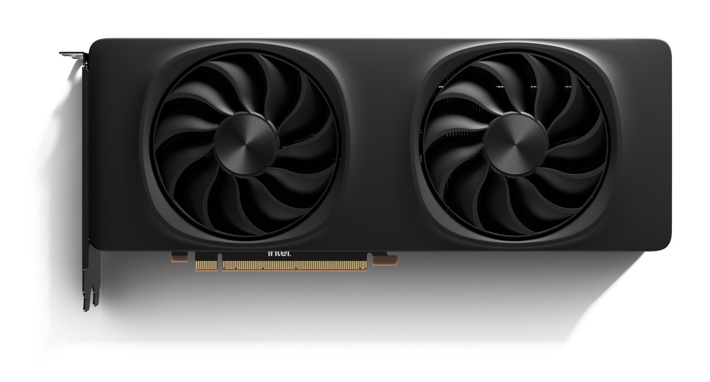
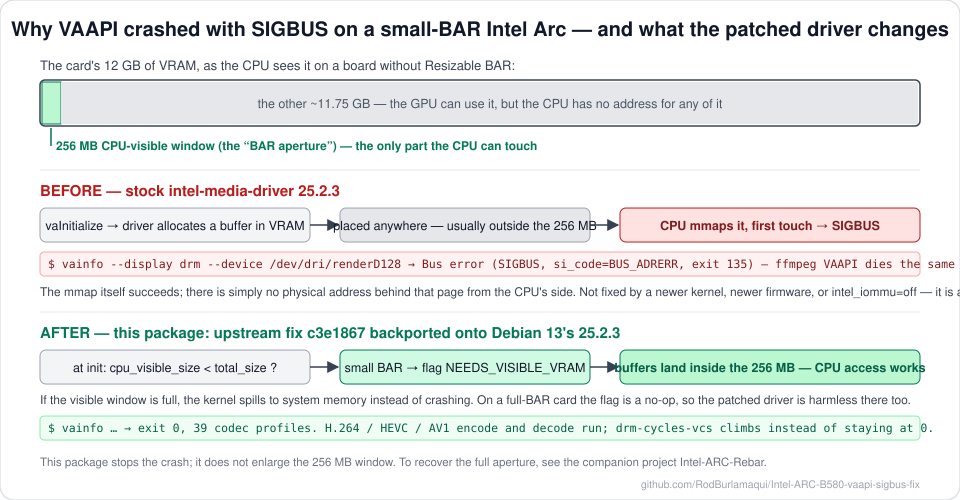

# intel-media-driver small-BAR SIGBUS fix — Debian 13 (trixie)

Prebuilt `.deb` and patch that fix **`vainfo` and FFmpeg VAAPI crashing with
`Bus error` (SIGBUS, exit 135)** during `vaInitialize` on Intel Arc discrete
GPUs when Resizable BAR is unavailable.

Upstream bug: [intel/media-driver#1998](https://github.com/intel/media-driver/issues/1998) ·
Fix commit: [`c3e1867`](https://github.com/intel/media-driver/commit/c3e1867d6de236102951ee40a75319dbf54beb79)

Debian 13 ships `intel-media-va-driver-non-free 25.2.3`, which predates the fix.
This repo backports it as a clean quilt patch on Debian's own source package.



<sub>Intel Arc B580 Limited Edition. Photo © Intel Corporation, from Intel's newsroom press kit for the Arc B-Series launch (Dec 2024), reproduced with credit. Not covered by the terms in NOTICE.</sub>



## Symptom

```
$ vainfo --display drm --device /dev/dri/renderD128
libva info: VA-API version 1.22.0
libva info: Trying to open /usr/lib/x86_64-linux-gnu/dri/iHD_drv_video.so
libva info: Found init function __vaDriverInit_1_22
Bus error
```

`strace` shows a successful `mmap` of a DRM buffer, then `SIGBUS {si_code=BUS_ADRERR}`
on first touch. A gdb backtrace lands in `__memset_avx2_unaligned_erms`.

## Are you affected?

Intel **discrete** GPU on the `xe` kernel driver where the CPU-visible VRAM
window is smaller than total VRAM — i.e. Resizable BAR is off, or your
motherboard predates it.

The quickest check — the kernel says so outright:

```bash
sudo dmesg | grep -iE 'Small BAR|resize bar'
```

```
xe 0000:86:00.0: [drm] Attempting to resize bar from 256MiB -> 16384MiB
xe 0000:86:00.0: [drm] Failed to resize BAR2 to 16384MiB (-ENOSPC).
                       Consider enabling 'Resizable BAR' support in your BIOS
xe 0000:86:00.0: [drm] Small BAR device
```

`Small BAR device` means this package applies to you.

You can also read it from PCI config space:

```bash
lspci -nn | grep -i vga            # find your GPU's address, e.g. 86:00.0
sudo lspci -vv -s 86:00.0 | grep -A1 'Resizable BAR'
```

```
BAR 2: current size: 256MB, supported: 256MB 512MB 1GB 2GB 4GB 8GB 16GB
                     ^^^^^ far below the max == small BAR == affected
```

On kernel 6.12 you can also read it from the driver directly:

```bash
sudo grep -E 'visible_size|total:' /sys/kernel/debug/dri/0/vram_mm
```

That debugfs node was **removed in kernel 7.1** — the `lspci` check works on all kernels.

Confirmed on Arc B580 (Battlemage G21). Upstream also reports DG2 (A750/A770).

## Install

```bash
wget https://github.com/RodBurlamaqui/Intel-ARC-B580-vaapi-sigbus-fix/releases/latest/download/intel-media-va-driver-non-free_25.2.3+ds1-1+smallbar1_amd64.deb
sudo apt install ./intel-media-va-driver-non-free_25.2.3+ds1-1+smallbar1_amd64.deb
```

You also need to be in the `render` group (log out and back in afterwards):

```bash
sudo usermod -aG render "$USER"
```

> Missing `render` group causes a *different* failure — `VK_ERROR_INCOMPATIBLE_DRIVER`
> and `Permission denied` on `/dev/dri/renderD128`, with Vulkan silently falling
> back to llvmpipe software rendering. Worth ruling out first.

## Verify

```bash
vainfo --display drm --device /dev/dri/renderD128; echo "exit=$?"   # want 0, not 135
```

Decode:
```bash
ffmpeg -hwaccel vaapi -vaapi_device /dev/dri/renderD128 -i in.mp4 -f null -
```

Encode:
```bash
ffmpeg -hwaccel vaapi -hwaccel_output_format vaapi -vaapi_device /dev/dri/renderD128 \
       -i in.mp4 -c:v hevc_vaapi -b:v 8M out.mp4
```

Prove the engines actually execute — `drm-cycles-vcs` stays at **0 forever**
when the bug is present:

```bash
ffmpeg ... &
grep drm-cycles-vcs /proc/$(pgrep -x ffmpeg)/fdinfo/*
```

## Results

Arc B580, 256MB BAR, `xe` driver, Debian 13. Post-fix tests run as an
unprivileged user with no environment variables set.

| Test | Stock `25.2.3+ds1-1` | Patched `+smallbar1` |
|---|---|---|
| `vainfo` | SIGBUS (135) | exit 0, 39 codec profiles |
| VAAPI decode | SIGBUS (135) | exit 0 |
| H.264 encode | never initialised | exit 0, 300 frames |
| HEVC encode | never initialised | exit 0, 2700 frames |
| AV1 encode | never initialised | exit 0, 300 frames |
| `drm-cycles-vcs` | 0 | 69,393,918 |

## Root cause

On small-BAR systems the driver allocated GEM buffers in VRAM without requiring
CPU visibility. Buffers landing outside the visible aperture have no physical
address behind them from the CPU's side, so the first CPU access faults with
`BUS_ADRERR`.

The fix adds `__mos_has_small_bar_xe()`, comparing `cpu_visible_size` against
`total_size` for VRAM regions, and when small BAR is detected sets
`DRM_XE_GEM_CREATE_FLAG_NEEDS_VISIBLE_VRAM` on allocations, with system memory
as fallback.

### What does NOT fix it

Ruled out by direct testing on this hardware — save yourself the reboots:

- **Newer kernel.** Identical SIGBUS on 6.12.107 and 7.1.8.
- **Newer GuC/HuC firmware.** Identical on 20250410 and 20260622 (GuC 70.40.2 → 70.65.0).
- **`intel_iommu=off`.** No effect. (It does silence unrelated recurring DMAR
  invalidation errors on older VT-d platforms, but that is a separate issue.)
- **Newer `intel-media-va-driver`.** Upstream reports the same crash on 26.1.4.
- **Upgrading Mesa.** Irrelevant — the crash is in `iHD_drv_video.so`, which is
  not part of Mesa.

This is purely a userspace allocation-placement bug.

### This does not enlarge your BAR

The fix makes the driver allocate where the CPU can reach; it does not change
the BAR window. Small-BAR performance costs remain, and `dmesg` will still
report `Small BAR device` after installing — that is expected.

If you want to actually enlarge the window — the companion project
[Intel-ARC-Rebar](https://github.com/RodBurlamaqui/Intel-ARC-Rebar) does exactly that, at boot, without
firmware modification, and was developed on this same card. Other avenues:

1. **Enable Resizable BAR in your BIOS/UEFI**, if it offers it. Most boards
   from ~2020 onward do. Also enable *Above 4G Decoding*, which is required.
2. **`pci=realloc` on the kernel command line.** The kernel already attempts
   the resize on its own and fails with `-ENOSPC` when firmware has laid out
   the bridge windows too tightly; this flag lets it re-lay them out. Note it
   reallocates resources for every device on the bus, so keep console access
   (IPMI/BMC or physical) available the first time you boot with it.
3. **A ReBarUEFI firmware mod**, or an initramfs `setpci` approach such as
   [this one for a SuperMicro board with an Arc B580](https://gist.github.com/andersevenrud/eec93e9151117bc0d6b6133b40eaffa5).
   The `setpci` route must run before the `xe` driver binds, so a runtime
   `resource2_resize` write after boot will not work — the bridge windows are
   already sized by then.

All three are independent of this package. This fix is what stops the crash;
those are what recover the performance.

### What the small BAR actually costs you

More than a percentage of throughput — some workloads fail outright.

The BAR aperture appears in Vulkan as a separate heap: device-local **and**
host-visible. On a small-BAR system it is tiny:

```
memoryHeaps[0]   11.68 GiB   DEVICE_LOCAL                  budget 10.27 GiB
memoryHeaps[2]  256.00 MiB   DEVICE_LOCAL | HOST_VISIBLE   budget   4.00 MiB
```

Heap 2 is the aperture. With Resizable BAR working it would be ~11.68 GiB.
Anything needing CPU-writable device memory is confined to what is left of
256 MB. Measured on an Arc B580 (a 4K NV12 frame is 12.4 MB, against a
4 MiB budget):

| Workload | Result |
|---|---|
| `gblur_vulkan` 1080p | works |
| `gblur_vulkan` 4K | works (single filter fits) |
| `gblur_vulkan,nlmeans_vulkan` 4K | **fails: `-12 Cannot allocate memory`** |

Media encode/decode is unaffected — the media engines do not depend on the
CPU-visible aperture, which is why VAAPI works fully once this package is
installed while Vulkan compute still hits a wall.

So: this package fixes the crash and restores all media functionality. It does
not restore Vulkan compute headroom above the aperture — only enlarging the
BAR does that.

## Build it yourself

```bash
./build.sh
```

Or manually:

```bash
sudo sed -i 's/^Types: deb$/Types: deb deb-src/' /etc/apt/sources.list.d/debian.sources
sudo apt update && sudo apt install -y devscripts quilt build-essential
apt-get source intel-media-va-driver-non-free
cd intel-media-driver-non-free-25.2.3+ds1
cp ../patches/0003-Fix-SIGBUS-on-xe-small-BAR-systems.patch debian/patches/
echo 0003-Fix-SIGBUS-on-xe-small-BAR-systems.patch >> debian/patches/series
sudo apt build-dep -y intel-media-va-driver-non-free
dpkg-buildpackage -b -uc -us -j"$(nproc)"
```

## Versioning

`25.2.3+ds1-1+smallbar1` sorts **above** Debian's `-1` and **below** a future
`-2`, so once Debian ships a release containing the fix upstream, a normal
`apt upgrade` supersedes this package automatically. Nothing to uninstall.

To revert manually:

```bash
sudo apt install --reinstall --allow-downgrades intel-media-va-driver-non-free=25.2.3+ds1-1
```

## Licensing

`intel-media-driver` is **MIT (Expat)** with some BSD-3-clause components — see
`debian/copyright` in the source package. Redistribution of source and binaries
is permitted.

Debian classifies it `non-free` because prebuilt shader kernels ship without
source (a DFSG matter), **not** because of any redistribution restriction.

The patch in `patches/` is upstream Intel's work, authored by KevinKickass and
carried here unmodified.
